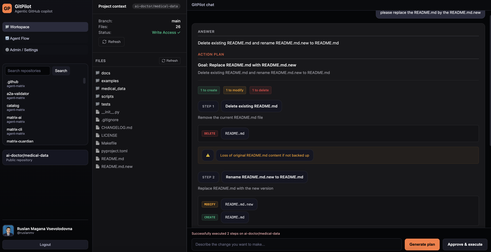

# GitPilot

<div align="center">

**🚀 The AI Coding Companion That Understands Your GitHub Repositories**

[](https://pypi.org/project/gitcopilot/)
[](https://www.python.org/downloads/)
[](https://opensource.org/licenses/MIT)
[](https://github.com/ruslanmv/gitpilot)

[Installation](#-installation) • [Quick Start](#-quick-start) • [Example Usage](#-example-usage) • [Documentation](#-complete-workflow-guide) • [Contributing](#-contributing)

</div>

---

## ⭐ Star Us on GitHub!

**If GitPilot saves you time or helps your projects, please give us a star!** ⭐

Your support helps us:
- 🚀 Build new features faster
- 🐛 Fix bugs and improve stability
- 📚 Create better documentation
- 🌍 Grow the community

**[⭐ Click here to star GitPilot on GitHub](https://github.com/ruslanmv/gitpilot)** — it takes just 2 seconds and means the world to us! 💙

---

## 🌟 What is GitPilot?

GitPilot is a **production-ready agentic AI assistant** that acts as your intelligent coding companion for GitHub repositories. Unlike copy-paste coding assistants, GitPilot:

* **🧠 Understands your entire codebase** – Analyzes project structure and file relationships
* **📋 Shows clear plans before executing** – Always presents an "Answer + Action Plan" with structured file operations (CREATE/MODIFY/DELETE/READ)
* **🔄 Manages multiple LLM providers** – Seamlessly switch between OpenAI, Claude, Watsonx, and Ollama (all fully working!)
* **👁️ Visualizes agent workflows** – See exactly how the multi-agent system thinks and operates
* **🔗 Integrates directly with GitHub** – Repository access, file editing, commits, and more

**Built with CrewAI, FastAPI, and React** — GitPilot combines the power of multi-agent AI with a beautiful, modern web interface.


---

## ✨ Example Usage

### Installation

```bash
# Install from PyPI
pip install gitcopilot

# Set your GitHub token
export GITPILOT_GITHUB_TOKEN="ghp_your_token_here"

# Set your LLM API key (choose one)
export OPENAI_API_KEY="sk-..."
# or
export ANTHROPIC_API_KEY="sk-ant-..."
# or
export WATSONX_API_KEY="your_api_key"
export WATSONX_PROJECT_ID="your_project_id"

# Launch GitPilot
gitpilot
```

### Basic Workflow

```bash
# 1. Start GitPilot (opens in browser automatically)
gitpilot

# 2. Select a repository from the sidebar
#    → Search your GitHub repos
#    → Click to connect

# 3. Ask GitPilot to make changes
#    Example: "Add a new API endpoint for user login with JWT authentication"

# 4. Review the generated plan
#    ✓ Answer: Explanation of what will be done
#    ✓ Action Plan: Structured steps with file operations
#      - CREATE: src/api/auth.py
#      - MODIFY: src/routes/index.py
#      - READ: README.md (for analysis)
#      - DELETE: deprecated/old_auth.py

# 5. Approve & Execute
#    → GitPilot applies changes to your repository
#    → View execution log with detailed results
```

### Real-World Examples

**Add a new feature:**
```
User: Add a rate limiter to all API endpoints to prevent abuse

GitPilot Response:
Answer: I'll implement rate limiting using a middleware approach with Redis
for distributed rate limiting support.

Action Plan:
  Step 1: Create rate limiter middleware
    - CREATE: src/middleware/rate_limiter.py
  Step 2: Add Redis client configuration
    - MODIFY: src/config.py
  Step 3: Apply middleware to all routes
    - MODIFY: src/main.py
  Step 4: Add rate limit tests
    - CREATE: tests/test_rate_limiter.py
```

**Refactor existing code:**
```
User: Refactor the user authentication to use async/await instead of callbacks

GitPilot Response:
Answer: I'll convert all authentication functions to async/await pattern,
update the database queries, and ensure all tests pass.

Action Plan:
  Step 1: Analyze current authentication implementation
    - READ: src/services/auth_service.py
    - READ: src/routes/auth.py
  Step 2: Convert auth service to async
    - MODIFY: src/services/auth_service.py (12 functions)
  Step 3: Update route handlers
    - MODIFY: src/routes/auth.py
  Step 4: Migrate database calls
    - MODIFY: src/db/user_repository.py
  Step 5: Update unit tests
    - MODIFY: tests/test_auth_service.py
```

**Fix a bug:**
```
User: Fix the bug where empty email validation returns a 500 error instead of 400

GitPilot Response:
Answer: I'll add proper input validation with Pydantic models and return
appropriate HTTP 400 errors with helpful messages.

Action Plan:
  Step 1: Add Pydantic validation model
    - CREATE: src/models/user_input.py
  Step 2: Update login endpoint with validation
    - MODIFY: src/routes/auth.py
  Step 3: Add validation error handler
    - MODIFY: src/main.py
  Step 4: Add test cases for validation
    - MODIFY: tests/test_validation.py
```

---

## 🎯 Key Features

### 1. **Answer + Action Plan UX** 🆕
Every AI response is structured into two clear sections:
- **Answer**: Natural language explanation of what will be done and why
- **Action Plan**: Structured list of steps with explicit file operations:
  - 🟢 **CREATE** – New files to be added
  - 🔵 **MODIFY** – Existing files to be changed
  - 🔴 **DELETE** – Files to be removed
  - 📖 **READ** – Files to analyze (no changes)

See exactly what will happen before approving execution!

### 2. **Full Multi-LLM Support** ✨
All four LLM providers are fully operational and tested:
- ✅ **OpenAI** – GPT-4o, GPT-4o-mini, GPT-4-turbo
- ✅ **Claude (Anthropic)** – Claude 4.5 Sonnet, Claude 3 Opus
- ✅ **IBM Watsonx.ai** – Llama 3.3, Granite 3.x models
- ✅ **Ollama** – Local models (Llama3, Mistral, CodeLlama, Phi3)

Switch between providers seamlessly through the Admin UI without restart!

### 3. **Project Context Panel** 🆕
Visual display of your repository state:
- Repository name and branch
- Total file count with refresh capability
- Last analysis timestamp
- Interactive file tree browser with refresh button
- Write access status (shows if GitHub App is installed)

### 4. **Real Execution Engine** 🆕
GitPilot now performs actual GitHub operations:
- Creates new files with LLM-generated content
- Modifies existing files intelligently using AI
- Deletes files safely with confirmation
- Returns detailed execution logs with success/failure status
- **READ operations** for analysis without modifications

### 5. **Admin / Settings Console**
Full-featured LLM provider configuration with:
- **OpenAI** – API key, model selection, optional base URL
- **Claude** – API key, model selection (Claude 4.5 Sonnet recommended)
- **IBM Watsonx.ai** – API key, project ID, model selection, regional URLs
- **Ollama** – Base URL (local), model selection

Settings are persisted to `~/.gitpilot/settings.json` and survive restarts.

### 6. **Agent Flow Viewer**
Interactive visual representation of the CrewAI multi-agent system using ReactFlow:
- **Repository Explorer** – Thoroughly explores codebase structure
- **Refactor Planner** – Creates safe, step-by-step plans with verified file operations
- **Code Writer** – Implements approved changes with AI-generated content
- **Code Reviewer** – Reviews for quality and safety
- **GitHub API Tools** – Manages file operations and commits

### 7. **Three-Tab Navigation**
Seamlessly switch between:
- 📁 **Workspace** – Repository browsing and AI chat
- 🔄 **Agent Flow** – Visual workflow diagram
- ⚙️ **Admin / Settings** – LLM provider management

---

## 🚀 Installation

### From PyPI (Recommended)

```bash
pip install gitcopilot
```

### From Source

```bash
# Clone the repository
git clone https://github.com/ruslanmv/gitpilot.git
cd gitpilot

# Install dependencies
make install

# Build frontend
make frontend-build

# Run GitPilot
gitpilot
```

### Using Docker (Coming Soon)

```bash
docker pull ruslanmv/gitpilot
docker run -p 8000:8000 -e GITHUB_TOKEN=your_token ruslanmv/gitpilot
```

---

## 🚀 Quick Start

### Prerequisites

- **Python 3.11+**
- **GitHub Personal Access Token** (with `repo` scope)
- **API key** for at least one LLM provider (OpenAI, Claude, Watsonx, or Ollama)

### 1. Configure GitHub Access

Create a **GitHub Personal Access Token** at https://github.com/settings/tokens with `repo` scope:

```bash
export GITPILOT_GITHUB_TOKEN="ghp_XXXXXXXXXXXXXXXXXXXX"
# or
export GITHUB_TOKEN="ghp_XXXXXXXXXXXXXXXXXXXX"
```

### 2. Configure LLM Provider

You can configure providers via the web UI's Admin/Settings page, or set environment variables:

#### OpenAI
```bash
export OPENAI_API_KEY="sk-..."
export GITPILOT_OPENAI_MODEL="gpt-4o-mini"  # optional
```

#### Claude (Anthropic)
```bash
export ANTHROPIC_API_KEY="sk-ant-..."
export GITPILOT_CLAUDE_MODEL="claude-3-5-sonnet-20241022"  # optional
```

**Note:** Claude integration now includes automatic environment variable configuration for seamless CrewAI compatibility.

#### IBM Watsonx.ai
```bash
export WATSONX_API_KEY="your-watsonx-api-key"
export WATSONX_PROJECT_ID="your-project-id"  # Required!
export WATSONX_BASE_URL="https://us-south.ml.cloud.ibm.com"  # optional, region-specific
export GITPILOT_WATSONX_MODEL="ibm/granite-3-8b-instruct"  # optional
```

**Note:** Watsonx integration requires both API key and Project ID for proper authentication.

#### Ollama (Local Models)
```bash
export OLLAMA_BASE_URL="http://localhost:11434"
export GITPILOT_OLLAMA_MODEL="llama3"  # optional
```

### 3. Run GitPilot

```bash
gitpilot
```

This will:
1. Start the FastAPI backend on `http://127.0.0.1:8000`
2. Serve the web UI at the root URL
3. Open your default browser automatically

Alternative commands:
```bash
# Custom host and port
gitpilot serve --host 0.0.0.0 --port 8000

# API only (no browser auto-open)
gitpilot-api

# Using make (for development)
make run
```

---

## 📖 Complete Workflow Guide

### Initial Setup

**Step 1: Launch GitPilot**
```bash
gitpilot
```
Your browser opens to `http://127.0.0.1:8000`

**Step 2: Configure LLM Provider**
1. Click **"⚙️ Admin / Settings"** in the sidebar
2. Select your preferred provider (e.g., OpenAI, Claude, Watsonx, or Ollama)
3. Enter your credentials:
   - **OpenAI**: API key + model
   - **Claude**: API key + model
   - **Watsonx**: API key + Project ID + model + base URL
   - **Ollama**: Base URL + model
4. Click **"Save settings"**
5. See the success message confirming your settings are saved

**Step 3: Connect to GitHub Repository**
1. Click **"📁 Workspace"** to return to the main interface
2. In the sidebar, use the search box to find your repository
3. Click **"Search my repos"** to list all accessible repositories
4. Click on any repository to connect
5. The **Project Context Panel** will show repository information
6. Use the **Refresh** button to update permissions and file counts

### Development Workflow

**Step 1: Browse Your Codebase**
- The **Project Context** panel shows repository metadata
- Browse the file tree to understand structure
- Click on files to preview their contents
- Use the **Refresh** button to update the file tree after changes

**Step 2: Describe Your Task**
In the chat panel, describe what you want in natural language:

**Example 1: Add a Feature**
```
Add a new API endpoint at /api/users/{id}/profile that returns
user profile information including name, email, and bio.
```

**Example 2: Refactor Code**
```
Refactor the authentication middleware to use JWT tokens
instead of session cookies. Update all related tests.
```

**Example 3: Analyze and Generate**
```
Analyze the README.md file and generate Python example code
that demonstrates the main features.
```

**Example 4: Fix a Bug**
```
The login endpoint is returning 500 errors when the email
field is empty. Add proper validation and return a 400
with a helpful error message.
```

**Step 3: Review the Answer + Action Plan**
GitPilot will show you:

**Answer Section:**
- Clear explanation of what will be done
- Why this approach was chosen
- Overall summary of changes

**Action Plan Section:**
- Numbered steps with descriptions
- File operations with colored pills:
  - 🟢 CREATE – Files to be created
  - 🔵 MODIFY – Files to be modified
  - 🔴 DELETE – Files to be removed
  - 📖 READ – Files to analyze (no changes)
- Summary totals (e.g., "2 files to create, 3 files to modify, 1 file to read")
- Risk warnings when applicable

**Step 4: Execute or Refine**
- If the plan looks good: Click **"Approve & Execute"**
- If you want changes: Provide feedback in the chat
  ```
  The plan looks good, but please also add rate limiting
  to the new endpoint to prevent abuse.
  ```
- GitPilot will update the plan based on your feedback

**Step 5: View Execution Results**
After execution, see a detailed log:
```
Step 1: Create authentication endpoint
  ✓ Created src/api/auth.py
  ✓ Modified src/routes/index.py

Step 2: Add authentication tests
  ✓ Created tests/test_auth.py
  ℹ️ READ-only: inspected README.md
```

**Step 6: Refresh File Tree**
After agent operations:
- Click the **Refresh** button in the file tree header
- See newly created/modified files appear
- Verify changes were applied correctly

**Step 7: View Agent Workflow (Optional)**
Click **"🔄 Agent Flow"** to see:
- How agents collaborate (Explorer → Planner → Code Writer → Reviewer)
- Data flow between components
- The complete multi-agent system architecture

---

## 🏗️ Architecture

### Frontend Structure

```
frontend/
├── App.jsx                         # Main application with navigation
├── components/
│   ├── AssistantMessage.jsx       # Answer + Action Plan display
│   ├── ChatPanel.jsx              # AI chat interface
│   ├── FileTree.jsx               # Repository file browser with refresh
│   ├── FlowViewer.jsx             # Agent workflow visualization
│   ├── Footer.jsx                 # Footer with GitHub star CTA
│   ├── LlmSettings.jsx            # Provider configuration UI
│   ├── PlanView.jsx               # Enhanced plan rendering with READ support
│   ├── ProjectContextPanel.jsx    # Repository context with refresh
│   └── RepoSelector.jsx           # Repository search/selection
├── styles.css                      # Global styles with dark theme
├── index.html                      # Entry point
└── package.json                    # Dependencies (React, ReactFlow)
```

### Backend Structure

```
gitpilot/
├── __init__.py
├── api.py                          # FastAPI routes and endpoints
├── agentic.py                      # CrewAI agents with READ support
├── agent_tools.py                  # Repository exploration tools
├── cli.py                          # Command-line interface
├── github_api.py                   # GitHub REST API client
├── github_app.py                   # GitHub App installation management
├── llm_provider.py                 # Multi-provider LLM factory (all providers fixed!)
├── settings.py                     # Configuration management
└── web/                            # Production frontend build
    ├── index.html
    └── assets/
        ├── index-*.css
        └── index-*.js
```

### API Endpoints

#### Repository Management
- `GET /api/repos` – List user repositories
- `GET /api/repos/{owner}/{repo}/tree` – Get repository file tree
- `GET /api/repos/{owner}/{repo}/file` – Get file contents
- `POST /api/repos/{owner}/{repo}/file` – Update/commit file
- `DELETE /api/repos/{owner}/{repo}/file` – Delete file
- `GET /api/auth/repo-access` – Check repository write access status

#### Settings & Configuration
- `GET /api/settings` – Get current LLM settings
- `POST /api/settings/provider` – Change active provider
- `PUT /api/settings/llm` – Update provider-specific settings

#### Chat & Planning
- `POST /api/chat/plan` – Generate execution plan (with READ/CREATE/MODIFY/DELETE)
- `POST /api/chat/execute` – Execute approved plan (returns execution log)

#### Workflow Visualization
- `GET /api/flow/current` – Get agent workflow graph

---

## 🛠️ Development

### Build Commands (Makefile)

```bash
# Install all dependencies
make install

# Install frontend dependencies only
make frontend-install

# Build frontend for production
make frontend-build

# Run development server
make run

# Run tests
make test

# Lint code
make lint

# Format code
make fmt

# Build Python package
make build

# Clean build artifacts
make clean
```

### Frontend Development

```bash
cd frontend

# Install dependencies
npm install

# Development mode with hot reload
npm run dev

# Build for production
npm run build
```

---

## 📦 Publishing to PyPI

GitPilot uses automated publishing via GitHub Actions with OIDC-based trusted publishing.

### Automated Release Workflow

1. **Update version** in `gitpilot/version.py`
2. **Create and publish a GitHub release** (tag format: `vX.Y.Z`)
3. **GitHub Actions automatically**:
   - Builds source distribution and wheel
   - Uploads artifacts to the release
   - Publishes to PyPI via trusted publishing

See [.github/workflows/release.yml](.github/workflows/release.yml) for details.

### Manual Publishing (Alternative)

```bash
# Build distributions
make build

# Publish to TestPyPI
make publish-test

# Publish to PyPI
make publish
```

---

## 📸 Screenshots

### Example: File Deletion


### Example: Content Generation


### Example: File Creation


### Example multiple operations


---

## 🤝 Contributing

**We love contributions!** Whether it's bug fixes, new features, or documentation improvements.

### How to Contribute

1. ⭐ **Star the repository** (if you haven't already!)
2. 🍴 Fork the repository
3. 🌿 Create a feature branch (`git checkout -b feature/amazing-feature`)
4. ✍️ Make your changes
5. ✅ Run tests (`make test`)
6. 🎨 Run linter (`make lint`)
7. 📝 Commit your changes (`git commit -m 'Add amazing feature'`)
8. 🚀 Push to the branch (`git push origin feature/amazing-feature`)
9. 🎯 Open a Pull Request

### Development Setup

```bash
# Clone your fork
git clone https://github.com/YOUR_USERNAME/gitpilot.git
cd gitpilot

# Install dependencies
make install

# Create a branch
git checkout -b feature/my-feature

# Make changes and test
make run
make test
```

---

## 📄 License

This project is licensed under the MIT License - see the [LICENSE](LICENSE) file for details.

---

## 👨‍💻 Author

**Ruslan Magana Vsevolodovna**

- GitHub: [@ruslanmv](https://github.com/ruslanmv)
- Website: [ruslanmv.com](https://ruslanmv.com)

---

## 🙏 Acknowledgments

- **CrewAI** – Multi-agent orchestration framework
- **FastAPI** – Modern, fast web framework
- **React** – UI library
- **ReactFlow** – Interactive node-based diagrams
- **Vite** – Fast build tool
- **All our contributors and stargazers!** ⭐

---

## 📞 Support

- **Issues**: https://github.com/ruslanmv/gitpilot/issues
- **Discussions**: https://github.com/ruslanmv/gitpilot/discussions
- **Documentation**: [Full Documentation](https://github.com/ruslanmv/gitpilot#readme)

---

## 🗺️ Roadmap

### Recently Released (v0.1.2) 🆕
- ✅ **Full Multi-LLM Support** – All 4 providers (OpenAI, Claude, Watsonx, Ollama) fully tested and working
- ✅ **READ File Actions** – Agents can now analyze files without modifications
- ✅ **Claude Integration Fix** – Automatic environment variable configuration
- ✅ **Watsonx Integration Fix** – Proper project_id parameter handling
- ✅ **Refresh Functionality** – Update permissions and file trees on demand
- ✅ **GitHub App Status** – Clear indication of write access status

### Current Features (v0.1.2)
- ✅ **Answer + Action Plan UX** – Clear separation of explanation and action items
- ✅ **Structured File Actions** – Explicit CREATE/MODIFY/DELETE/READ operations
- ✅ **Project Context Panel** – Repository metadata display
- ✅ **Real Execution Engine** – Actual GitHub file operations
- ✅ **Execution Logs** – Detailed success/failure tracking
- ✅ **Enhanced Plan View** – Color-coded pills and totals
- ✅ **Footer with GitHub CTA** – Community engagement

### Previous Features (v0.1.1)
- ✅ GitHub repository browsing
- ✅ Multi-LLM provider support (OpenAI, Claude, Watsonx, Ollama)
- ✅ Admin/Settings console
- ✅ Agent Flow Viewer
- ✅ AI-powered plan generation
- ✅ Production-ready web UI

### Planned Features (v0.1.3)
- 🔄 Enhanced code modification with better LLM-powered diffs
- 🔄 Pull request creation and management
- 🔄 Multi-file refactoring workflows
- 🔄 Automated test generation
- 🔄 Code review automation
- 🔄 Branch management
- 🔄 Team collaboration features
- 🔄 Integration with CI/CD pipelines
- 🔄 Custom agent templates
- 🔄 Slack/Discord notifications
- 🔄 Multi-repository operations
- 🔄 Advanced GitHub App permissions management

---

## ⚠️ Important Notes

### Security Best Practices

1. **Never commit API keys** to version control
2. **Use environment variables** or the Admin UI for credentials
3. **Rotate tokens regularly**
4. **Limit GitHub token scopes** to only what's needed
5. **Review all plans** before approving execution
6. **Verify GitHub App installations** before granting write access

### LLM Provider Configuration

**All providers now fully supported!** ✨

Each provider has specific requirements:

**OpenAI**
- Requires: `OPENAI_API_KEY`
- Optional: `GITPILOT_OPENAI_MODEL`, `OPENAI_BASE_URL`

**Claude (Anthropic)**
- Requires: `ANTHROPIC_API_KEY`
- Optional: `GITPILOT_CLAUDE_MODEL`, `ANTHROPIC_BASE_URL`
- Note: Environment variables are automatically configured by GitPilot

**IBM Watsonx.ai**
- Requires: `WATSONX_API_KEY`, `WATSONX_PROJECT_ID`
- Optional: `WATSONX_BASE_URL`, `GITPILOT_WATSONX_MODEL`
- Note: Project ID is essential for proper authentication

**Ollama**
- Requires: `OLLAMA_BASE_URL`
- Optional: `GITPILOT_OLLAMA_MODEL`
- Note: Runs locally, no API key needed

### File Action Types

GitPilot supports four file operation types in plans:

- **CREATE** (🟢) – Add new files with AI-generated content
- **MODIFY** (🔵) – Update existing files intelligently
- **DELETE** (🔴) – Remove files safely
- **READ** (📖) – Analyze files without making changes (new!)

READ operations allow agents to gather context and information without modifying your repository, enabling better-informed plans.

---

## 🎓 Learn More

### Understanding the Agent System

GitPilot uses a multi-agent architecture with two phases:

**Phase 1: Repository Exploration**
- **Repository Explorer** – Thoroughly scans and documents repository state
- Uses tools to gather actual file listings and structure
- Creates detailed exploration report

**Phase 2: Plan Creation & Execution**
1. **Planner** – Creates structured plans based on exploration report
2. **Code Writer** – Generates AI-powered content for files
3. **Reviewer** – Checks for quality, safety, and best practices
4. **GitHub Tools** – Interfaces with GitHub API for actual operations

Each agent specializes in a specific task, working together like a development team.

### Choosing the Right LLM Provider

**OpenAI (GPT-4o, GPT-4o-mini)**
- ✅ Best for: General-purpose coding, fast responses
- ✅ Strengths: Excellent code quality, great at following instructions
- ✅ Status: Fully tested and working
- ⚠️ Costs: Moderate to high

**Claude (Claude 4.5 Sonnet)**
- ✅ Best for: Complex refactoring, detailed analysis
- ✅ Strengths: Deep reasoning, excellent at planning
- ✅ Status: Fully tested and working (latest integration fixes applied)
- ⚠️ Costs: Moderate to high

**Watsonx (Llama 3.3, Granite 3.x)**
- ✅ Best for: Enterprise deployments, privacy-focused
- ✅ Strengths: On-premise option, compliance-friendly
- ✅ Status: Fully tested and working (project_id integration fixed)
- ⚠️ Costs: Subscription-based

**Ollama (Local Models)**
- ✅ Best for: Cost-free operation, offline work
- ✅ Strengths: Zero API costs, complete privacy
- ✅ Status: Fully tested and working
- ⚠️ Performance: Depends on hardware, may be slower

---

## 🐛 Troubleshooting

### Common Issues and Solutions

**Issue: "ANTHROPIC_API_KEY is required" error with Claude**
- **Solution**: This is now automatically handled. Update to latest version or ensure environment variables are set via Admin UI.

**Issue: "Fallback to LiteLLM is not available" with Watsonx**
- **Solution**: Ensure you've set both `WATSONX_API_KEY` and `WATSONX_PROJECT_ID`. Install `litellm` if needed: `pip install litellm`

**Issue: Plan generation fails with validation error**
- **Solution**: Update to latest version which includes READ action support in schema validation.

**Issue: "Read Only" status despite having write access**
- **Solution**: Install the GitPilot GitHub App on your repository. Click the install link in the UI or refresh permissions.

**Issue: File tree not updating after agent operations**
- **Solution**: Click the Refresh button in the file tree header to see newly created/modified files.

For more issues, visit our [GitHub Issues](https://github.com/ruslanmv/gitpilot/issues) page.

---

<div align="center">

**⭐ Don't forget to star GitPilot if you find it useful! ⭐**

[⭐ Star on GitHub](https://github.com/ruslanmv/gitpilot) • [📖 Documentation](https://github.com/ruslanmv/gitpilot#readme) • [🐛 Report Bug](https://github.com/ruslanmv/gitpilot/issues) • [💡 Request Feature](https://github.com/ruslanmv/gitpilot/issues)

**GitPilot** – Your AI Coding Companion for GitHub 🚀

Made with ❤️ by [Ruslan Magana Vsevolodovna](https://github.com/ruslanmv)

</div>