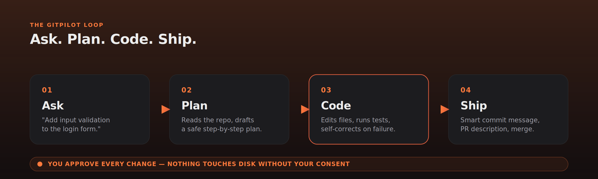
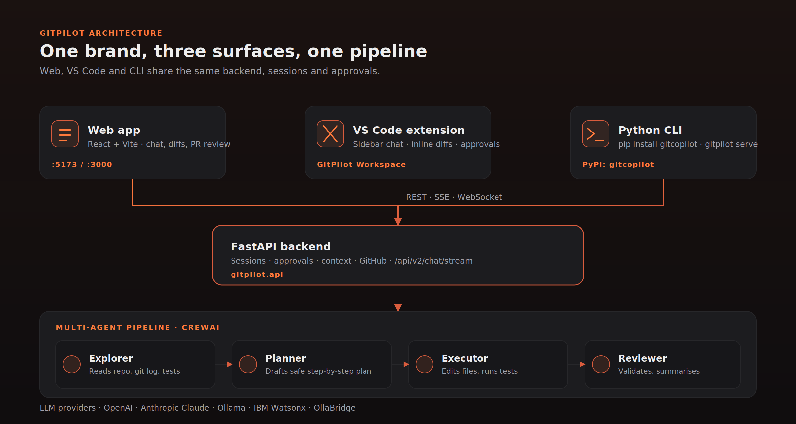

<div align="center">


# GitPilot

### The open-source AI coding companion your team can actually trust.

**Ask. Plan. Code. Ship.** &nbsp;·&nbsp; You approve every change.


[](https://pypi.org/project/gitcopilot/)
[](https://www.python.org/)
[](LICENSE)
[](https://marketplace.visualstudio.com/)
[](#contributing)

[**Get Started**](#get-started) &nbsp;·&nbsp; [VS Code](#vs-code-extension) &nbsp;·&nbsp; [Web App](#web-app) &nbsp;·&nbsp; [How It Works](#how-it-works) &nbsp;·&nbsp; [Providers](#supported-ai-providers)

</div>

---

<p align="center">
  <picture>
    <source srcset="docs/assets/flow.svg" type="image/svg+xml" />
    
  </picture>
</p>

## Why GitPilot?

GitPilot is the AI pair programmer built for teams that take code seriously. It reads your repository, drafts a safe plan, writes the code, runs your tests — and **waits for your approval before touching a single file**. No surprises, no silent commits, no lock-in.

- 🧭 **Works where you work** — the same experience in VS Code, on the web, and from the terminal. One login, one history, one set of approvals.
- 🔐 **Safe by default** — every file edit, shell command, and git operation asks for permission first. Diffs are shown before they're applied, tests run before anything is committed.
- 🧠 **Your model, your rules** — drop in OpenAI, Anthropic Claude, IBM Watsonx, Ollama (local) or OllaBridge (free cloud). Switch providers in settings without changing a line of code.
- 🏢 **Enterprise-ready, open source** — MIT licensed, 854 passing tests, Docker & Hugging Face deployment recipes, no telemetry, no vendor lock-in.
- 🌍 **Runs anywhere** — your laptop, your private cloud, air-gapped environments, or a managed host. Your repo stays your repo.

---

## What is GitPilot?

GitPilot is an AI assistant that helps you ship better code, faster — without giving up control. It understands your project, plans changes you can read before they happen, writes the code, runs your tests, and drafts the commit message and pull request for you.

**Works with any language. Runs on any LLM.** Start free and local with Ollama, or bring your own OpenAI, Claude, or Watsonx key.

```
You: "Add input validation to the login form"

GitPilot:
  1. Reading src/auth/login.ts...
  2. Planning 3 changes...
  3. Editing login.ts (Allow? [Yes] [No])
  4. Running npm test... 3 passed
  5. Done.
```

---

## Get Started

### Option 1: VS Code Extension (recommended)

Install the extension, configure your LLM, and start chatting:

```
1. Open VS Code
2. Install "GitPilot Workspace" from Extensions
3. Click the GitPilot icon in the sidebar
4. Choose your AI provider (OpenAI, Claude, Ollama...)
5. Start asking questions about your code
```

### Option 2: Web App

Run the full web interface with Docker:

```bash
git clone https://github.com/ruslanmv/gitpilot.git
cd gitpilot
docker compose up
```

Open [http://localhost:3000](http://localhost:3000) in your browser.

### Option 3: Python CLI (fastest)

```bash
pip install gitcopilot
gitpilot serve
```

Open [http://localhost:8000](http://localhost:8000) and you're done.

> **Heads up:** the PyPI package is published as **`gitcopilot`** (the name `gitpilot` was already taken) but the command you run is `gitpilot`. Python **3.11** or **3.12** required.

---

## VS Code Extension

The sidebar panel gives you everything in one place:

| Feature | What it does |
|---|---|
| **Chat** | Ask questions, request changes, review code |
| **Plan View** | See the step-by-step plan before changes are made |
| **Diff Preview** | Review proposed edits in VS Code's native diff viewer |
| **Apply / Revert** | One click to apply changes, one click to undo |
| **Quick Actions** | Explain, Review, Fix, Generate Tests, Security Scan |
| **Smart Commit** | AI-generated commit messages |
| **Code Lens** | Inline "Explain / Review" hints on functions |

### Supported AI Providers

| Provider | Setup | Free? |
|---|---|---|
| **Ollama** | Install Ollama, run `ollama pull llama3` | Yes |
| **OllaBridge** | Works out of the box (cloud Ollama) | Yes |
| **OpenAI** | Add your API key in settings | Paid |
| **Claude** | Add your Anthropic API key | Paid |
| **Watsonx** | Add IBM credentials | Paid |

---

## Web App

The web interface includes:

- Chat with real-time responses
- GitHub integration (connect your repos)
- File tree browser
- Diff viewer with line-by-line changes
- Pull request creation
- Session history with checkpoints
- Multi-repo support

---

## How It Works

<p align="center">
  <picture>
    <source srcset="docs/assets/architecture.svg" type="image/svg+xml" />
    
  </picture>
</p>

GitPilot uses a multi-agent system powered by CrewAI:

1. **Explorer** reads your repo structure, git log, and key files
2. **Planner** creates a safe step-by-step plan with diffs
3. **Executor** writes code and runs tests, self-correcting on failure
4. **Reviewer** validates the output and summarises what changed

You approve every change before it's applied.

---

## Project Structure

```
gitpilot/
  gitpilot/           Python backend (FastAPI)
  frontend/           React web app
  extensions/vscode/  VS Code extension
  docs/               Documentation and assets
  tests/              Test suite
```

---

## Configuration

GitPilot works with environment variables or the settings UI.

**Minimal setup** (Ollama, free, local):

```bash
# .env
GITPILOT_PROVIDER=ollama
OLLAMA_BASE_URL=http://localhost:11434
GITPILOT_OLLAMA_MODEL=llama3
```

**Cloud setup** (OpenAI):

```bash
# .env
GITPILOT_PROVIDER=openai
OPENAI_API_KEY=sk-...
GITPILOT_OPENAI_MODEL=gpt-4o-mini
```

**Cloud setup** (Claude):

```bash
# .env
GITPILOT_PROVIDER=claude
ANTHROPIC_API_KEY=sk-ant-...
GITPILOT_CLAUDE_MODEL=claude-sonnet-4-5
```

All settings can also be changed from the VS Code extension or web UI without editing files.

---

## API

GitPilot exposes a REST + WebSocket API:

| Endpoint | What it does |
|---|---|
| `GET /api/status` | Server health check |
| `POST /api/chat/send` | Send a message, get a response |
| `POST /api/v2/chat/stream` | Stream agent events (SSE) |
| `WS /ws/v2/sessions/{id}` | Real-time WebSocket streaming |
| `POST /api/chat/plan` | Generate an execution plan |
| `POST /api/chat/execute` | Execute a plan |
| `GET /api/repos` | List connected repositories |
| `GET /api/sessions` | List chat sessions |

Full API docs at `http://localhost:8000/docs` (Swagger UI).

---

## Deployment

### Hugging Face Spaces <p>
  <a href="https://huggingface.co/spaces/ruslanmv/gitpilot">
    
  </a>
</p>

GitPilot runs on Hugging Face Spaces with OllaBridge (free):

```
Runtime: Docker
Port: 7860
Provider: OllaBridge (cloud Ollama)
```

### Docker Compose

```bash
docker compose up -d
# Backend: http://localhost:8000
# Frontend: http://localhost:3000
```

### Vercel

The frontend deploys to Vercel. Set `VITE_BACKEND_URL` to your backend.

---

## Contributing

```bash
# Backend
cd gitpilot
pip install -e ".[dev]"
pytest

# Frontend
cd frontend
npm install
npm run dev

# VS Code Extension
cd extensions/vscode
npm install
make compile
# Press F5 in VS Code to launch debug host
```

---

## License

MIT License. See [LICENSE](LICENSE).

---

<div align="center">

**GitPilot** is made by [Ruslan Magana Vsevolodovna](https://github.com/ruslanmv)

[Star on GitHub](https://github.com/ruslanmv/gitpilot) &#8226; [Report a Bug](https://github.com/ruslanmv/gitpilot/issues) &#8226; [Request a Feature](https://github.com/ruslanmv/gitpilot/issues)

</div>
