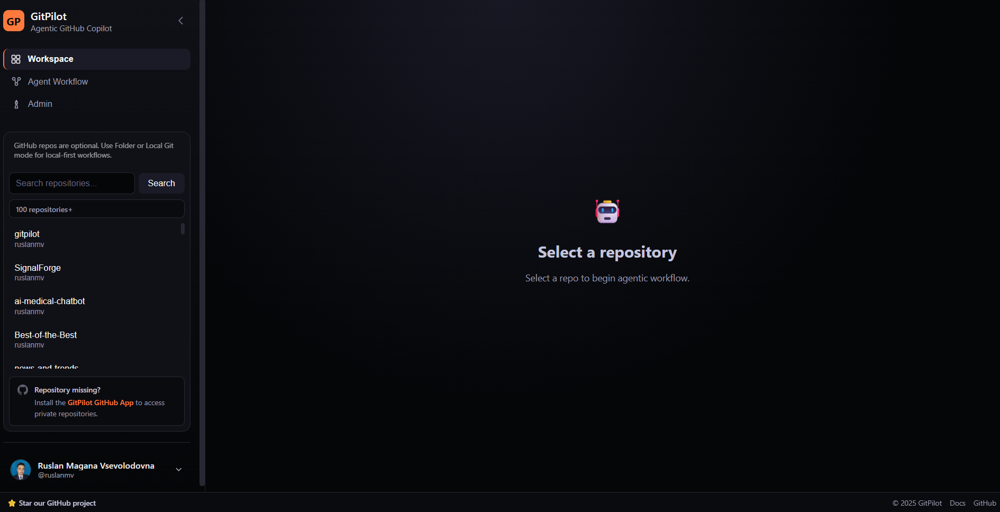
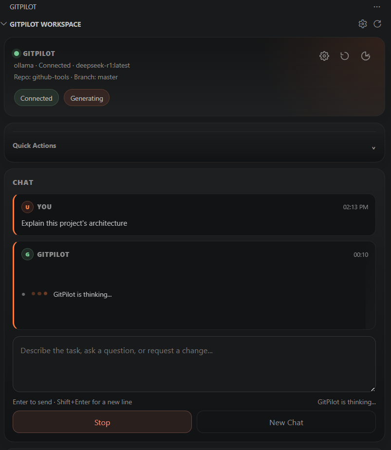
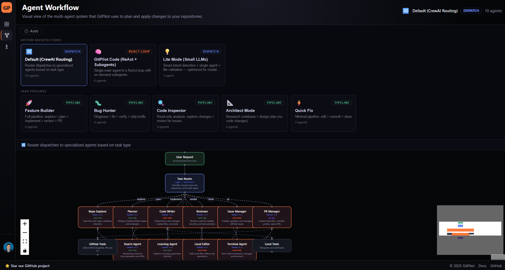

<div align="center">


# GitPilot

### The first open-source multi-agent AI coding assistant.

Four specialized agents &mdash; Explorer, Planner, Coder, Reviewer &mdash; collaborate on every task.<br/>
By default, GitPilot asks before every risky action. Switch to Auto or Plan mode anytime.

[](https://pypi.org/project/gitcopilot/)
[](https://www.python.org/)
[](LICENSE)
[](https://marketplace.visualstudio.com/)
[](#contributing)

[**Get Started**](#get-started) &nbsp;·&nbsp; [VS Code](#vs-code-extension) &nbsp;·&nbsp; [Web App](#web-app) &nbsp;·&nbsp; [How It Works](#how-it-works) &nbsp;·&nbsp; [Providers](#supported-ai-providers)

</div>

---

<p align="center">
  <picture>
    <source srcset="docs/assets/flow.svg" type="image/svg+xml" />
    
  </picture>
</p>

## Why GitPilot?

Most AI coding tools are a **single model behind a chat box**. GitPilot is fundamentally different: it deploys a **team of four specialized AI agents** that collaborate on every task — just like a real engineering team.

| Agent | Role | What it does |
|---|---|---|
| **Explorer** | Context | Reads your full repo, git log, test suite, and dependencies so the plan starts with real knowledge — not guesses |
| **Planner** | Strategy | Drafts a safe, step-by-step plan with diffs and surfaces risks before any file is touched |
| **Coder** | Execution | Writes code, runs your tests, and self-corrects on failure — iterating until the suite passes |
| **Reviewer** | Quality | Validates the output, re-runs the suite, and drafts a commit message and PR summary |

**You control how the agent runs.** Three execution modes — selectable per session from the VS Code compose bar or backend API:

| Mode | Default? | Behavior |
|---|---|---|
| **Ask** | Yes | Prompts you before each dangerous action (write, edit, run, commit). You see the diff and click Allow / Deny. |
| **Auto** | | Executes all tools automatically. Fastest for experienced users who trust the plan. |
| **Plan** | | Read-only. Generates and displays the plan but blocks all file writes and commands. |

Diffs are shown before they're applied. Tests run before anything is committed. No surprises.

### What else sets GitPilot apart

- 🧭 **Works where you work** — VS Code, web app, and CLI share one login, one history, and one set of approvals.
- 🧠 **Any LLM, zero lock-in** — OpenAI, Anthropic Claude, IBM Watsonx, Ollama (local & free) or OllaBridge. Switch in settings, no code change.
- 🔐 **Private by default** — run the entire stack locally with Ollama. No telemetry, no data leaves your machine.
- 🏢 **Enterprise-ready, Apache 2.0 open source** — 854 passing tests, Docker & Hugging Face deployment recipes, audit the code yourself.
- 🌍 **Runs anywhere** — laptop, private cloud, air-gapped environments, or managed hosting. Your repo, your rules.

---

## What is GitPilot?

GitPilot is an AI assistant that helps you ship better code, faster — without giving up control. It understands your project, plans changes you can read before they happen, writes the code, runs your tests, and drafts the commit message and pull request for you.

**Works with any language. Runs on any LLM.** Start free and local with Ollama, or bring your own OpenAI, Claude, or Watsonx key.

```
You: "Add input validation to the login form"

GitPilot:
  1. Reading src/auth/login.ts...
  2. Planning 3 changes...
  3. Editing login.ts → [Apply Patch] [Revert]
  4. Running npm test... 3 passed
  5. Done — files written to your workspace.
```

---

## Get Started

### Option 1: VS Code Extension (recommended)

Install the extension, configure your LLM, and start chatting:

```
1. Open VS Code
2. Install "GitPilot Workspace" from Extensions
3. Click the GitPilot icon in the sidebar
4. Choose your AI provider (OpenAI, Claude, Ollama...)
5. Start asking questions about your code
```

### Option 2: Web App

Run the full web interface with Docker:

```bash
git clone https://github.com/ruslanmv/gitpilot.git
cd gitpilot
docker compose up
```

Open [http://localhost:3000](http://localhost:3000) in your browser.

### Option 3: Python CLI (fastest)

```bash
pip install gitcopilot
gitpilot serve
```

Open [http://localhost:8000](http://localhost:8000) and you're done.

> **Heads up:** the PyPI package is published as **`gitcopilot`** (the name `gitpilot` was already taken) but the command you run is `gitpilot`. Python **3.11** or **3.12** required.

---

## VS Code Extension

The sidebar panel gives you everything in one place:

| Feature | What it does |
|---|---|
| **Chat** | Ask questions, request changes, review code |
| **Execution Modes** | Bottom bar: `Auto` / `Ask` / `Plan` — controls agent permissions per session |
| **Plan View** | See the step-by-step plan before changes are made |
| **Plan Approval** | "Approve & Execute" / "Dismiss" bar — execution waits for your OK |
| **Tool Approvals** | Per-action Allow / Allow for session / Deny cards (Ask mode) |
| **Diff Preview** | Review proposed edits in VS Code's native diff viewer |
| **Apply / Revert** | One click to apply changes, one click to undo |
| **Quick Actions** | Explain, Review, Fix, Generate Tests, Security Scan |
| **Smart Commit** | AI-generated commit messages |
| **Code Lens** | Inline "Explain / Review" hints on functions |
| **Settings Tab** | Branded settings page (General, Provider, Agent, Editor) |
| **New Chat** | One click to clear chat and start a fresh session |

### Execution modes

The compose bar includes a mode selector that controls how the multi-agent pipeline runs:

```
[ Auto | Ask | Plan ]    [ Send ]    [ New Chat ]
```

| Mode | VS Code setting | Backend value | What happens |
|---|---|---|---|
| **Ask** (default) | `gitpilot.permissionMode: "normal"` | `"normal"` | Each dangerous tool (write, edit, run, commit) shows an approval card |
| **Auto** | `gitpilot.permissionMode: "auto"` | `"auto"` | Tools execute automatically — no approval prompts |
| **Plan** | `gitpilot.permissionMode: "plan"` | `"plan"` | Plan is generated and displayed, all writes/commands blocked |

Mode changes are persisted to VS Code settings and synced to the backend via `PUT /api/permissions/mode`.

### How approvals work

```
You send a request
  → Explorer reads repo context
  → Planner drafts step-by-step plan
  → Plan appears in sidebar (Approve & Execute / Dismiss)
  → You click Approve
  → Coder begins execution
  → Dangerous tool requested (e.g. write_file)
    → Ask mode: approval card shown (Allow / Allow for session / Deny)
    → Auto mode: executes immediately
    → Plan mode: blocked
  → Tests run, Reviewer validates
  → Done — Apply Patch or Revert
```

> **Note:** Simple questions (e.g. "explain this code") may return a direct answer without generating a multi-step plan. This is expected — the planner activates for tasks that require file changes or multi-step execution.

### Code generation and Apply Patch

When you ask GitPilot to create or edit files, the response includes structured `edits` — not just text. The **Apply Patch** button writes them directly to your workspace.

```
You: "Create a Flask app with app.py, requirements.txt, and README.md"

GitPilot:
  → LLM generates 3 files with content
  → Backend extracts structured edits (path + content)
  → VS Code shows [Apply Patch] [Revert]
  → You click Apply Patch
  → 3 files written to disk
  → Project context refreshes automatically
  → First file opens in the editor
```

How it works under the hood:
- The LLM is instructed to output code blocks with the filename on the fence line (` ```python hello.py`)
- The backend parses these blocks into `ProposedEdit` objects with file path, kind, and content
- All paths are sanitized (rejects `../` traversal, absolute paths, drive letters)
- The extension stores edits in `activeTask.edits` and shows Apply / Revert
- `PatchApplier` writes files via `vscode.workspace.fs.writeFile`
- After apply, project context refreshes and the first file opens

> **Note:** For folder-only sessions (no GitHub remote), code generation uses the LLM directly with structured output instructions. For GitHub-connected sessions, the full CrewAI multi-agent pipeline (Explorer → Planner → Coder → Reviewer) handles planning and execution.

### Supported AI Providers

| Provider | Setup | Free? |
|---|---|---|
| **Ollama** | Install Ollama, run `ollama pull llama3` | Yes |
| **OllaBridge** | Works out of the box (cloud Ollama) | Yes |
| **OpenAI** | Add your API key in settings | Paid |
| **Claude** | Add your Anthropic API key | Paid |
| **Watsonx** | Add IBM credentials | Paid |

---

## Web App

The web interface includes:

- Chat with real-time responses
- GitHub integration (connect your repos)
- File tree browser
- Diff viewer with line-by-line changes
- Pull request creation
- Session history with checkpoints
- Multi-repo support


### Example: File Deletion


### Example: Content Generation


### Example: File Creation


### Example multiple operations


### Example of multiagent topologies


---

## How It Works

<p align="center">
  <picture>
    <source srcset="docs/assets/architecture.svg" type="image/svg+xml" />
    
  </picture>
</p>

GitPilot uses a multi-agent system powered by CrewAI:

1. **Explorer** reads your repo structure, git log, and key files
2. **Planner** creates a safe step-by-step plan with diffs
3. **Executor** writes code and runs tests, self-correcting on failure
4. **Reviewer** validates the output and summarises what changed

In **Ask** mode (default), you approve every change before it's applied. In **Auto** mode, tools execute without prompts. In **Plan** mode, only the plan is generated — no files are touched.

---

## Project Structure

```
gitpilot/
  gitpilot/           Python backend (FastAPI)
  frontend/           React web app
  extensions/vscode/  VS Code extension
  docs/               Documentation and assets
  tests/              Test suite
```

---

## Configuration

GitPilot works with environment variables or the settings UI.

**Minimal setup** (Ollama, free, local):

```bash
# .env
GITPILOT_PROVIDER=ollama
OLLAMA_BASE_URL=http://localhost:11434
GITPILOT_OLLAMA_MODEL=llama3
```

**Cloud setup** (OpenAI):

```bash
# .env
GITPILOT_PROVIDER=openai
OPENAI_API_KEY=sk-...
GITPILOT_OPENAI_MODEL=gpt-4o-mini
```

**Cloud setup** (Claude):

```bash
# .env
GITPILOT_PROVIDER=claude
ANTHROPIC_API_KEY=sk-ant-...
GITPILOT_CLAUDE_MODEL=claude-sonnet-4-5
```

All settings can also be changed from the VS Code extension or web UI without editing files.

---

## API

GitPilot exposes a REST + WebSocket API:

| Endpoint | What it does |
|---|---|
| `GET /api/status` | Server health check |
| `POST /api/chat/send` | Send a message, get a response |
| `POST /api/v2/chat/stream` | Stream agent events (SSE) — accepts `permission_mode` |
| `WS /ws/v2/sessions/{id}` | Real-time WebSocket streaming |
| `POST /api/chat/plan` | Generate an execution plan |
| `POST /api/chat/execute` | Execute a plan |
| `GET /api/repos` | List connected repositories |
| `GET /api/sessions` | List chat sessions |
| `GET /api/permissions` | Current permission policy |
| `PUT /api/permissions/mode` | Set execution mode: `normal` / `auto` / `plan` |
| `POST /api/v2/approval/respond` | Approve or deny a tool execution request |

Full API docs at `http://localhost:8000/docs` (Swagger UI).

---

## Deployment

### Hugging Face Spaces

GitPilot runs on Hugging Face Spaces with OllaBridge (free):

```
Runtime: Docker
Port: 7860
Provider: OllaBridge (cloud Ollama)
```

### Docker Compose

```bash
docker compose up -d
# Backend: http://localhost:8000
# Frontend: http://localhost:3000
```

### Vercel

The frontend deploys to Vercel. Set `VITE_BACKEND_URL` to your backend.

---

## Contributing

```bash
# Backend
cd gitpilot
pip install -e ".[dev]"
pytest

# Frontend
cd frontend
npm install
npm run dev

# VS Code Extension
cd extensions/vscode
npm install
make compile
# Press F5 in VS Code to launch debug host
```

---

## License

Apache License 2.0. See [LICENSE](LICENSE).

---

<div align="center">

**GitPilot** is made by [Ruslan Magana Vsevolodovna](https://github.com/ruslanmv)

[Star on GitHub](https://github.com/ruslanmv/gitpilot) &#8226; [Report a Bug](https://github.com/ruslanmv/gitpilot/issues) &#8226; [Request a Feature](https://github.com/ruslanmv/gitpilot/issues)

</div>
